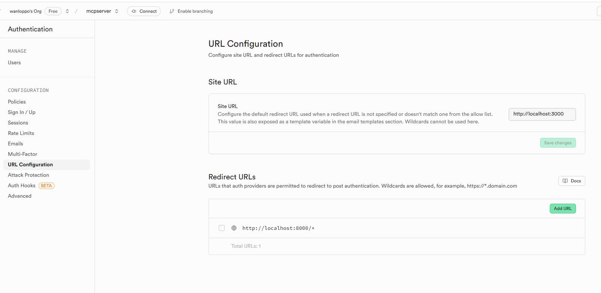
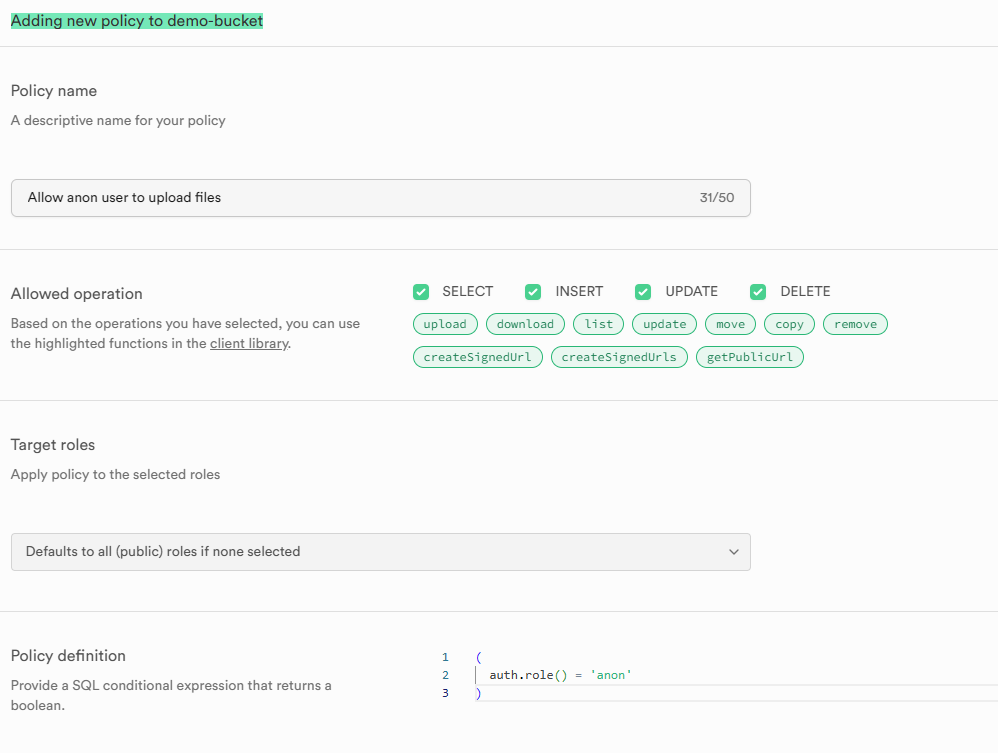

# Supabase-fastapi

## Create conda env for supabase_fastapi

conda create --name supabase_fastapi  Python=3.12 -y
source C:/ProgramData/anaconda3/Scripts/activate supabase_fastapi

pip install -r requirements.txt

uvicorn main:app --reload

pip install supabase

## SQL Query for new table:
create table employees (
  id serial primary key,
  first_name text not null,
  last_name text not null,
  email text unique not null,
  salary numeric not null,
  image_url text,
  is_active boolean default true
);

## URL Configuration
 
## Storage policies
 
## For bucket we need to add this policy:
(
  auth.role() = 'anon'
)

